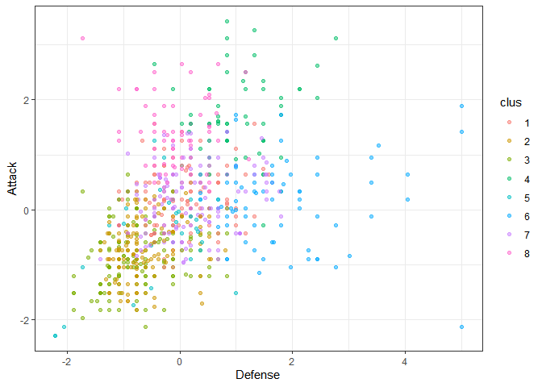
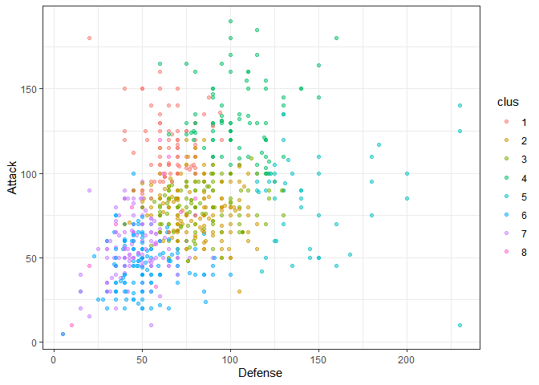
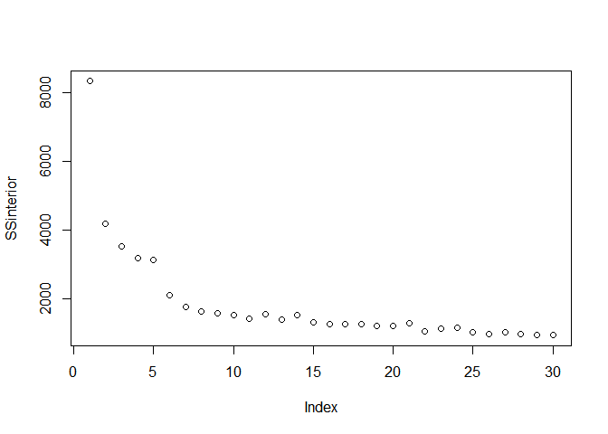
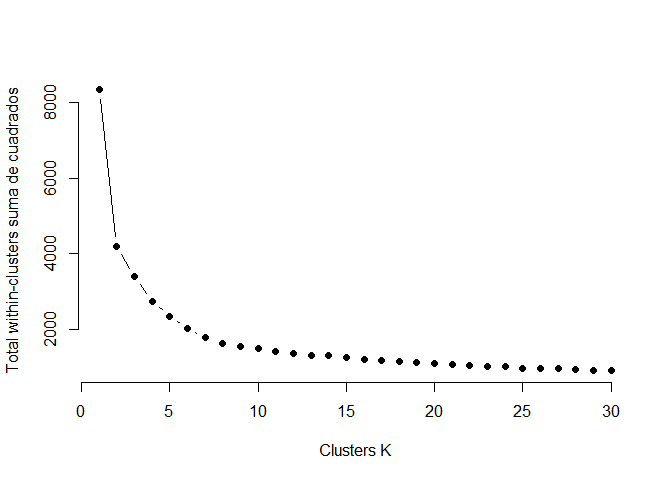
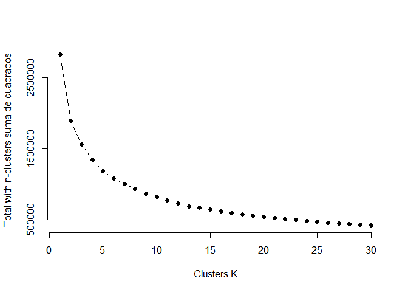
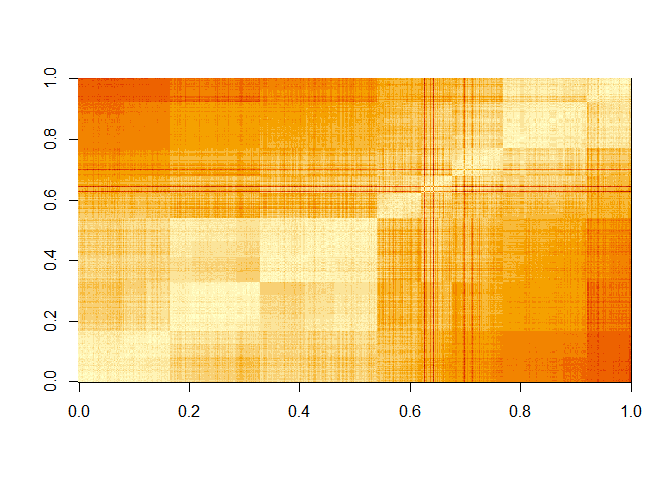
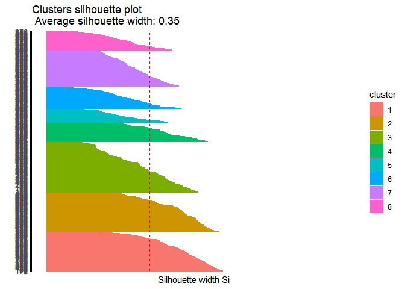
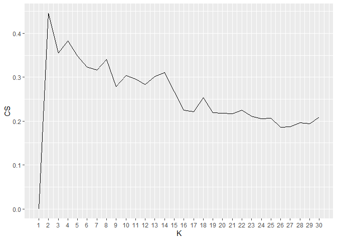

Actividad Ayudantía 5-Cristóbal Paredes
================

``` r
getwd()
```

    ## [1] "C:/Users/Cristobal/Desktop/Minería de D"

``` r
setwd("C:/Users/Cristobal/Desktop/Minería de D")
Pokemon<-read.csv("pokemon.csv",sep=",")
library(tidyverse)
```

    ## -- Attaching packages --------------------------------------- tidyverse 1.3.1 --

    ## v ggplot2 3.3.3     v purrr   0.3.4
    ## v tibble  3.1.0     v dplyr   1.0.5
    ## v tidyr   1.1.3     v stringr 1.4.0
    ## v readr   1.4.0     v forcats 0.5.1

    ## -- Conflicts ------------------------------------------ tidyverse_conflicts() --
    ## x dplyr::filter() masks stats::filter()
    ## x dplyr::lag()    masks stats::lag()

``` r
head(Pokemon)
```

    ##   X.                  Name Type.1 Type.2 Total HP Attack Defense Sp..Atk
    ## 1  1             Bulbasaur  Grass Poison   318 45     49      49      65
    ## 2  2               Ivysaur  Grass Poison   405 60     62      63      80
    ## 3  3              Venusaur  Grass Poison   525 80     82      83     100
    ## 4  3 VenusaurMega Venusaur  Grass Poison   625 80    100     123     122
    ## 5  4            Charmander   Fire          309 39     52      43      60
    ## 6  5            Charmeleon   Fire          405 58     64      58      80
    ##   Sp..Def Speed Generation Legendary
    ## 1      65    45          1     False
    ## 2      80    60          1     False
    ## 3     100    80          1     False
    ## 4     120    80          1     False
    ## 5      50    65          1     False
    ## 6      65    80          1     False

``` r
summary(Pokemon)
```

    ##        X.            Name              Type.1             Type.2         
    ##  Min.   :  1.0   Length:800         Length:800         Length:800        
    ##  1st Qu.:184.8   Class :character   Class :character   Class :character  
    ##  Median :364.5   Mode  :character   Mode  :character   Mode  :character  
    ##  Mean   :362.8                                                           
    ##  3rd Qu.:539.2                                                           
    ##  Max.   :721.0                                                           
    ##      Total             HP             Attack       Defense      
    ##  Min.   :180.0   Min.   :  1.00   Min.   :  5   Min.   :  5.00  
    ##  1st Qu.:330.0   1st Qu.: 50.00   1st Qu.: 55   1st Qu.: 50.00  
    ##  Median :450.0   Median : 65.00   Median : 75   Median : 70.00  
    ##  Mean   :435.1   Mean   : 69.26   Mean   : 79   Mean   : 73.84  
    ##  3rd Qu.:515.0   3rd Qu.: 80.00   3rd Qu.:100   3rd Qu.: 90.00  
    ##  Max.   :780.0   Max.   :255.00   Max.   :190   Max.   :230.00  
    ##     Sp..Atk          Sp..Def          Speed          Generation   
    ##  Min.   : 10.00   Min.   : 20.0   Min.   :  5.00   Min.   :1.000  
    ##  1st Qu.: 49.75   1st Qu.: 50.0   1st Qu.: 45.00   1st Qu.:2.000  
    ##  Median : 65.00   Median : 70.0   Median : 65.00   Median :3.000  
    ##  Mean   : 72.82   Mean   : 71.9   Mean   : 68.28   Mean   :3.324  
    ##  3rd Qu.: 95.00   3rd Qu.: 90.0   3rd Qu.: 90.00   3rd Qu.:5.000  
    ##  Max.   :194.00   Max.   :230.0   Max.   :180.00   Max.   :6.000  
    ##   Legendary        
    ##  Length:800        
    ##  Class :character  
    ##  Mode  :character  
    ##                    
    ##                    
    ## 

### Para Clusterizar usaremos las variables HP,Attach,Speed,Generation,Defense,Total,Legendary

``` r
Pok_1 <- Pokemon[, colnames(Pokemon) %in% c("HP", "Attack", "Defense", "Speed", "Generation")]
escal_Pokemon = scale(Pok_1) %>% as_tibble()
escal_Pokemon %>% summary()
```

    ##        HP              Attack           Defense            Speed        
    ##  Min.   :-2.6732   Min.   :-2.2800   Min.   :-2.2077   Min.   :-2.1774  
    ##  1st Qu.:-0.7542   1st Qu.:-0.7395   1st Qu.:-0.7646   1st Qu.:-0.8010  
    ##  Median :-0.1668   Median :-0.1233   Median :-0.1232   Median :-0.1128  
    ##  Mean   : 0.0000   Mean   : 0.0000   Mean   : 0.0000   Mean   : 0.0000  
    ##  3rd Qu.: 0.4207   3rd Qu.: 0.6470   3rd Qu.: 0.5181   3rd Qu.: 0.7475  
    ##  Max.   : 7.2741   Max.   : 3.4198   Max.   : 5.0077   Max.   : 3.8445  
    ##    Generation     
    ##  Min.   :-1.3988  
    ##  1st Qu.:-0.7968  
    ##  Median :-0.1949  
    ##  Mean   : 0.0000  
    ##  3rd Qu.: 1.0090  
    ##  Max.   : 1.6109

### Una vez escalada nuestra BD, aplicamos K-medias con K=8

``` r
kmeans_1 <- kmeans(escal_Pokemon, centers = 8)
kmeans_2 <- kmeans(Pok_1, centers = 8)
```

\#\#Creamos la Variable Cluster

``` r
escal_Pokemon$clus <- kmeans_1$cluster %>% as.factor()
Pok_1$clus <- kmeans_2$cluster %>% as.factor()
ggplot(escal_Pokemon, aes(Defense, Attack, color=clus)) +
  geom_point(alpha=0.5, show.legend = T) +
  theme_bw()
```

<!-- -->

``` r
ggplot(Pok_1, aes(Defense, Attack, color=clus)) +
  geom_point(alpha=0.5, show.legend = T) +
  theme_bw()
```

<!-- -->
\#\#\#Arrojamos La información de nuestros clusters

``` r
info_clusters <- kmeans_1$centers
info_clusters2 <- kmeans_2$centers
info_clusters
```

    ##           HP     Attack     Defense      Speed  Generation
    ## 1  0.1117709  0.1889891  0.02602772  0.6714266 -0.94617431
    ## 2 -0.6581211 -0.7046314 -0.60942608 -0.6247119  1.01826545
    ## 3 -0.8246657 -0.8246068 -0.74675025 -0.5542202 -0.81462928
    ## 4  1.2601984  1.6482776  1.03273765  0.6867361 -0.17606795
    ## 5  2.0463301 -0.3505838 -0.31563166 -0.7803555 -0.20825511
    ## 6 -0.1561986  0.1640020  1.78397139 -0.9391111 -0.05659472
    ## 7  0.2855111  0.1393625  0.20035159  0.5190265  1.01393876
    ## 8  0.2229765  1.3805271 -0.10133437  1.3160938  0.51216402

``` r
info_clusters2
```

    ##          HP    Attack   Defense     Speed Generation
    ## 1  74.50000 116.15000  65.85000 101.15000   3.475000
    ## 2  73.22785  79.34810  79.74684  48.65190   3.310127
    ## 3  76.05303  79.71970  83.38636  98.95455   3.356061
    ## 4  93.55814 133.17442 103.65116  81.09302   3.500000
    ## 5  65.10870  84.28261 147.17391  42.69565   3.434783
    ## 6  49.57823  46.72789  50.29252  38.95238   3.346939
    ## 7  51.29851  55.76119  46.88806  76.46269   3.119403
    ## 8 155.00000  69.29412  49.35294  51.23529   2.705882

\#\#\#Evolución suma de cuadrados

``` r
SSinterior <- numeric(30)
for(k in 1:30){
  modelo <- kmeans(escal_Pokemon, centers = k)
  SSinterior[k] <- modelo$tot.withinss
}
plot(SSinterior)
```

<!-- -->
\#\#\#Método del codo 2

``` r
k.max <- 30
wss1 <- sapply(1:k.max, 
              function(k){kmeans(escal_Pokemon, k, nstart=50,iter.max = 8)$tot.withinss})
wss2 <- sapply(1:k.max, 
              function(k){kmeans(Pok_1, k, nstart=50,iter.max = 8)$tot.withinss})
```

    ## Warning: did not converge in 8 iterations

    ## Warning: did not converge in 8 iterations

    ## Warning: did not converge in 8 iterations

    ## Warning: did not converge in 8 iterations

    ## Warning: did not converge in 8 iterations

    ## Warning: did not converge in 8 iterations

    ## Warning: did not converge in 8 iterations

    ## Warning: did not converge in 8 iterations

    ## Warning: did not converge in 8 iterations

    ## Warning: did not converge in 8 iterations

    ## Warning: did not converge in 8 iterations

    ## Warning: did not converge in 8 iterations

    ## Warning: did not converge in 8 iterations

    ## Warning: did not converge in 8 iterations

    ## Warning: did not converge in 8 iterations

    ## Warning: did not converge in 8 iterations

    ## Warning: did not converge in 8 iterations

    ## Warning: did not converge in 8 iterations

    ## Warning: did not converge in 8 iterations

    ## Warning: did not converge in 8 iterations

    ## Warning: did not converge in 8 iterations

    ## Warning: did not converge in 8 iterations

    ## Warning: did not converge in 8 iterations

    ## Warning: did not converge in 8 iterations

    ## Warning: did not converge in 8 iterations

    ## Warning: did not converge in 8 iterations

    ## Warning: did not converge in 8 iterations

    ## Warning: did not converge in 8 iterations

    ## Warning: did not converge in 8 iterations

    ## Warning: did not converge in 8 iterations

    ## Warning: did not converge in 8 iterations

    ## Warning: did not converge in 8 iterations

    ## Warning: did not converge in 8 iterations

    ## Warning: did not converge in 8 iterations

    ## Warning: did not converge in 8 iterations

    ## Warning: did not converge in 8 iterations

    ## Warning: did not converge in 8 iterations

    ## Warning: did not converge in 8 iterations

    ## Warning: did not converge in 8 iterations

    ## Warning: did not converge in 8 iterations

    ## Warning: did not converge in 8 iterations

    ## Warning: did not converge in 8 iterations

    ## Warning: did not converge in 8 iterations

\#\#\#Gráficamos wss1 y wss2

``` r
plot(1:k.max, wss1,
     type="b", pch = 19, frame = FALSE, 
     xlab="Clusters K",
     ylab="Total within-clusters suma de cuadrados")
```

<!-- -->

``` r
plot(1:k.max, wss2,
     type="b", pch = 19, frame = FALSE, 
     xlab="Clusters K",
     ylab="Total within-clusters suma de cuadrados")
```

<!-- -->

\#\#\#Evaluación–&gt; Inspección Visual

``` r
escal_Pokemon$clus <- as.numeric(escal_Pokemon$clus)
Pok_1$clus <- as.numeric(Pok_1$clus)
## Usamos Distancia Euclidiana
tempDist <- dist(escal_Pokemon) %>% as.matrix()
#reordenamos  filas y columnas según el cluster que obtuvimos
index <- sort(kmeans_1$cluster, index.return=TRUE)
tempDist <- tempDist[index$ix,index$ix]
rownames(tempDist) <- c(1:nrow(escal_Pokemon))
colnames(tempDist) <- c(1:nrow(escal_Pokemon))
image(tempDist)
```

<!-- -->
\#\#\#Estadístico de Hopkins

``` r
library(factoextra)
```

    ## Welcome! Want to learn more? See two factoextra-related books at https://goo.gl/ve3WBa

``` r
res <- get_clust_tendency(escal_Pokemon, n = 30, graph = FALSE)
res2 <- get_clust_tendency(Pok_1, n = 30, graph = FALSE)
print(res)
```

    ## $hopkins_stat
    ## [1] 0.813349
    ## 
    ## $plot
    ## NULL

``` r
print(res2)
```

    ## $hopkins_stat
    ## [1] 0.8234993
    ## 
    ## $plot
    ## NULL

\#\#\#Índice de Correlación

``` r
#Realizamos Correlación
tempMatrix <- matrix(0, nrow = nrow(Pok_1), ncol = nrow(Pok_1))
tempMatrix[which(index$x==1), which(index$x==1)]  <- 1
tempMatrix[which(index$x==2), which(index$x==2)]  <- 1
tempMatrix[which(index$x==3), which(index$x==3)]  <- 1
tempMatrix[which(index$x==4), which(index$x==4)]  <- 1
tempMatrix[which(index$x==5), which(index$x==5)]  <- 1
tempMatrix[which(index$x==6), which(index$x==6)]  <- 1
tempMatrix[which(index$x==7), which(index$x==7)]  <- 1
tempMatrix[which(index$x==8), which(index$x==8)]  <- 1
tempMatrix[which(index$x==9), which(index$x==9)]  <- 1
tempMatrix[which(index$x==10), which(index$x==10)] <- 1
##Obtenemos matriz de disimilitud
tempDist2 <- 1/(1+tempDist)

##Calculamos  correlación 
cor <- cor(tempMatrix[upper.tri(tempMatrix)],tempDist2[upper.tri(tempDist2)])

print(cor)
```

    ## [1] 0.7224596

\#\#Índice de cohesión y separación

``` r
library(flexclust)
```

    ## Loading required package: grid

    ## Loading required package: lattice

    ## Loading required package: modeltools

    ## Loading required package: stats4

``` r
withinCluster <- numeric(8)
for (i in 1:8){
  tempdata_pk <- escal_Pokemon[which(kmeans_1$cluster == i),]
  withinCluster[i] <- sum(dist2(tempdata_pk,colMeans(tempdata_pk))^2)
}
cohesion = sum(withinCluster)
#es equivalente a model$tot.withinss en k-means
print(c(cohesion, kmeans_1$tot.withinss))
```

    ## [1] 1633.113 1633.113

\#\#\#Ahora, realizaremos la separación

``` r
meandata_pk <- colMeans(escal_Pokemon)
SSB <- numeric(8)
for (i in 1:8){
  tempdata_pk <- escal_Pokemon[which(kmeans_1$cluster==i),]
  SSB[i] <- nrow(tempdata_pk)*sum((meandata_pk-colMeans(tempdata_pk))^2)
}
separation = sum(SSB)

print(separation)
```

    ## [1] 6694.526

\#\#\#Desarrollamos Nuestro Coeficiente de Silueta

``` r
library(cluster)
coefSil <- silhouette(kmeans_1$cluster,dist(escal_Pokemon))
summary(coefSil)
```

    ## Silhouette of 800 units in 8 clusters from silhouette.default(x = kmeans_1$cluster, dist = dist(escal_Pokemon)) :
    ##  Cluster sizes and average silhouette widths:
    ##       133       130       169        64        45        74       122        63 
    ## 0.4432991 0.4362250 0.3161693 0.3920383 0.2551122 0.2666170 0.2979552 0.2601644 
    ## Individual silhouette widths:
    ##    Min. 1st Qu.  Median    Mean 3rd Qu.    Max. 
    ## 0.05428 0.25259 0.34590 0.34768 0.44562 0.59525

\#\#\#Arrojamos código de silueta de cada Cluster

``` r
fviz_silhouette(coefSil) + coord_flip()
```

    ##   cluster size ave.sil.width
    ## 1       1  133          0.44
    ## 2       2  130          0.44
    ## 3       3  169          0.32
    ## 4       4   64          0.39
    ## 5       5   45          0.26
    ## 6       6   74          0.27
    ## 7       7  122          0.30
    ## 8       8   63          0.26

<!-- -->

``` r
coefSil=numeric(30)
for (k in 2:30){
  modelo1 <- kmeans(escal_Pokemon, centers = k)
  temp <- silhouette(modelo1$cluster,dist(escal_Pokemon))
  coefSil[k] <- mean(temp[,3])
}
tempDF=data.frame(CS=coefSil,K=c(1:30))

ggplot(tempDF, aes(x=K, y=CS)) + 
  geom_line() +
  scale_x_continuous(breaks=c(1:30))
```

<!-- -->
